````md
# Sports Hall Reservation System

A full-stack web application for browsing, managing, and reserving sports halls.  
The system allows regular users to search sports venues, view venue details, reserve available time slots, manage their profile, and contact support. It also includes role-based admin and venue-manager panels for managing users, venues, bookings, facilities, and reports.

---

## Table of Contents

- [Overview](#overview)
- [Features](#features)
- [User Roles](#user-roles)
- [Tech Stack](#tech-stack)
- [Project Structure](#project-structure)
- [Screenshots](#screenshots)
- [Backend Setup](#backend-setup)
- [Frontend Setup](#frontend-setup)
- [Environment Variables](#environment-variables)
- [Main API Endpoints](#main-api-endpoints)
- [Database Models](#database-models)
- [Usage Flow](#usage-flow)
- [Future Improvements](#future-improvements)
- [Author](#author)

---

## Overview

Sports Hall Reservation System is designed to simplify the process of finding and reserving sports venues.  
Users can register, log in, browse available halls, filter venues by sport or city, view hall details, and submit booking requests for available time slots.

The application also provides an admin dashboard for system administrators and venue managers. Admin users can manage users, venues, reservations, active user reports, reservation statistics, and hall usage statistics.

---

## Features

### Public and User Features

- User registration and login
- JWT-based authentication
- Browse sports halls
- Search venues by name, city, location, amenities, or sport
- Filter venues by sport
- View detailed venue information
- View available booking slots
- Create a booking request
- View personal booking history
- Update user profile
- Submit contact/support messages
- Forgot password and reset password with verification code

### Admin and Venue Manager Features

- Role-based access control
- Admin dashboard
- User management
- Venue management
- Create, update, and delete halls
- Update hall facilities
- View all bookings
- Filter bookings by status, date range, and search query
- Confirm or cancel booking requests
- View total reservation reports
- View active user reports
- View hall usage statistics
- Separate permissions for system admins and venue managers

---

## User Roles

The system supports three user roles:

| Role | Description |
|---|---|
| `user` | Regular user who can browse halls and create bookings |
| `venue-manager` | Manager who can manage their own halls and related bookings |
| `sys-admin` | System administrator with access to user, venue, booking, and report management |

---

## Tech Stack

### Frontend

- React
- Vite
- React Router DOM
- React Bootstrap
- Bootstrap
- React Icons
- Three.js
- React Three Fiber
- Drei

### Backend

- Python
- Django
- Django REST Framework
- Django REST Framework Simple JWT
- SQLite database
- CORS Headers
- SMTP email service for password reset

---

## Project Structure

```text
Sports-Hall-Reservation/
│
├── backend/
│   ├── api/
│   │   ├── management/
│   │   ├── migrations/
│   │   ├── admin.py
│   │   ├── apps.py
│   │   ├── models.py
│   │   ├── pagination.py
│   │   ├── permissions.py
│   │   ├── renderers.py
│   │   ├── serializers.py
│   │   ├── urls.py
│   │   ├── utils.py
│   │   └── views.py
│   │
│   ├── config/
│   │   ├── settings.py
│   │   ├── urls.py
│   │   ├── asgi.py
│   │   └── wsgi.py
│   │
│   ├── manage.py
│   └── requirements.txt
│
├── frontend/
│   ├── public/
│   ├── src/
│   │   ├── api/
│   │   ├── assets/
│   │   ├── components/
│   │   ├── pages/
│   │   │   ├── admin/
│   │   │   ├── auth/
│   │   │   ├── contactSupport/
│   │   │   ├── home/
│   │   │   ├── profile/
│   │   │   └── venueDetails/
│   │   │
│   │   ├── App.jsx
│   │   ├── App.css
│   │   ├── index.css
│   │   └── main.jsx
│   │
│   ├── index.html
│   ├── package.json
│   └── vite.config.js
│
├── README.md
└── notes.txt
````

---

## Screenshots

Create a folder named `docs/screenshots` in the root of the project and place the screenshots there.

```text
docs/
└── screenshots/
    ├── home-page.png
    ├── login-page.png
    ├── register-page.png
    ├── venue-list.png
    ├── venue-details.png
    ├── booking-slots.png
    ├── profile-page.png
    ├── contact-support.png
    ├── admin-dashboard.png
    ├── admin-users.png
    ├── admin-venues.png
    ├── admin-bookings.png
    ├── reserves-report.png
    ├── active-users-report.png
    └── usage-stats.png
```

### Home Page

<!-- screenshot: take a screenshot of the landing/home page after running the frontend -->

<figure>
  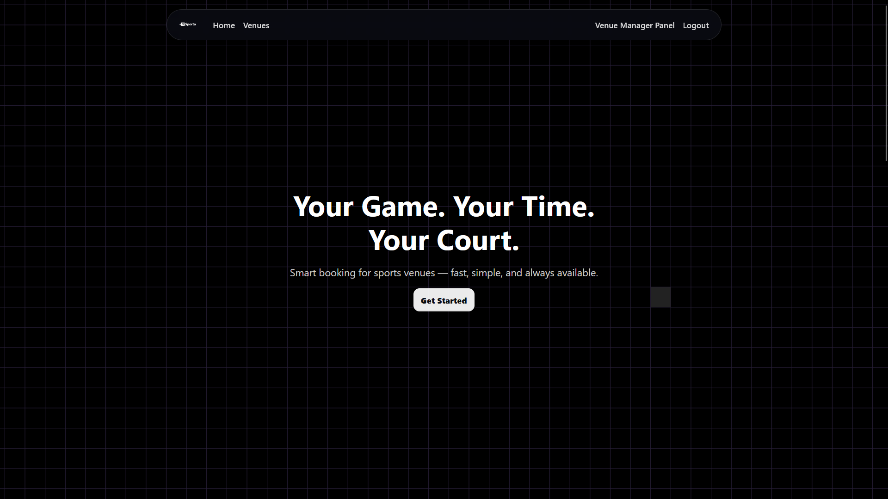
  <figcaption>Home page with hero section, navigation, and sports venue overview.</figcaption>
</figure>

### Login Page

<!-- screenshot: take a screenshot of the login page -->

<figure>
  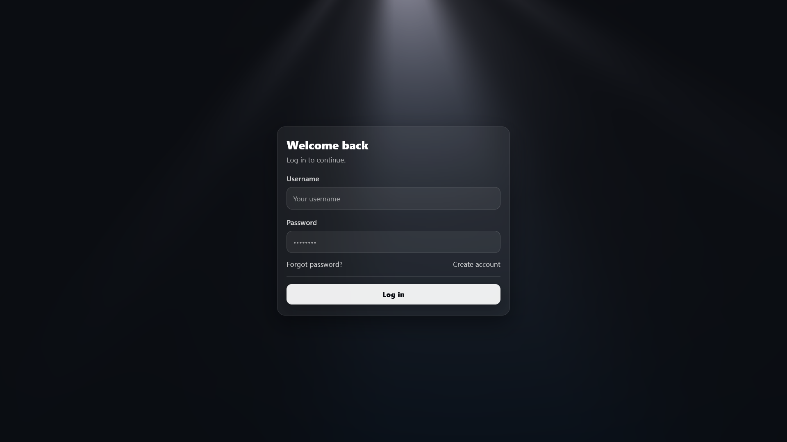
  <figcaption>User login page for accessing the reservation system.</figcaption>
</figure>

### Register Page

<!-- screenshot: take a screenshot of the register page -->

<figure>
  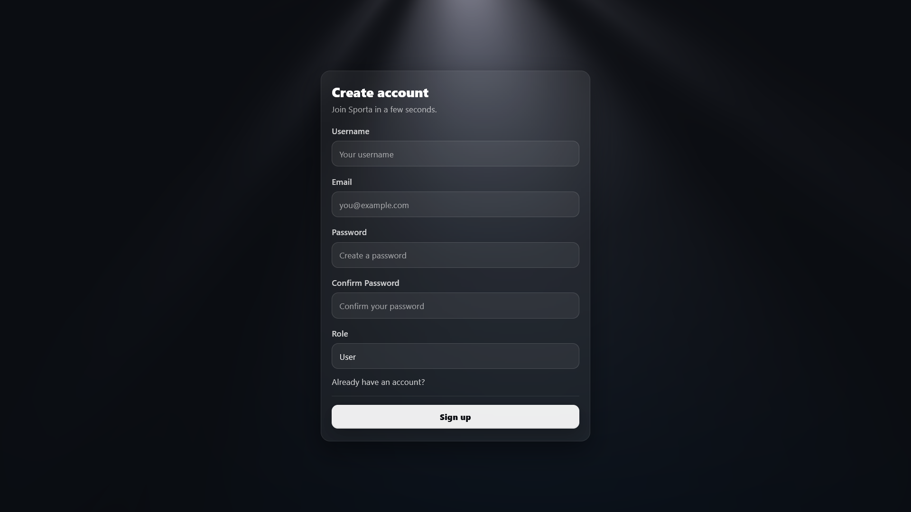
  <figcaption>Registration page for creating a new user account.</figcaption>
</figure>

### Venue List

<!-- screenshot: take a screenshot of the venue listing section with search/filter visible -->

<figure>
  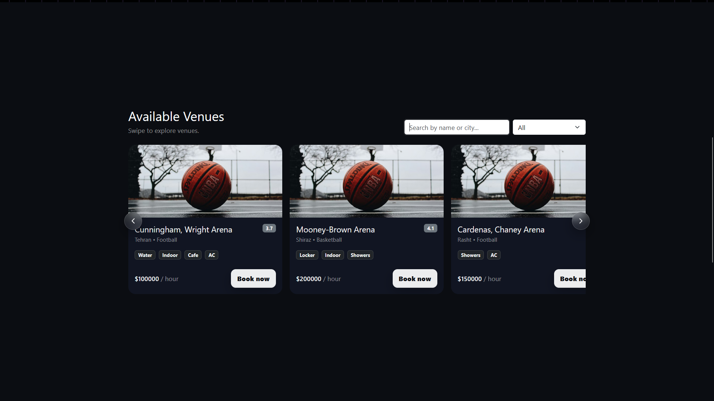
  <figcaption>Venue listing page with sports hall cards, search, and filtering options.</figcaption>
</figure>

### Venue Details

<!-- screenshot: take a screenshot of a single venue details page -->

<figure>
  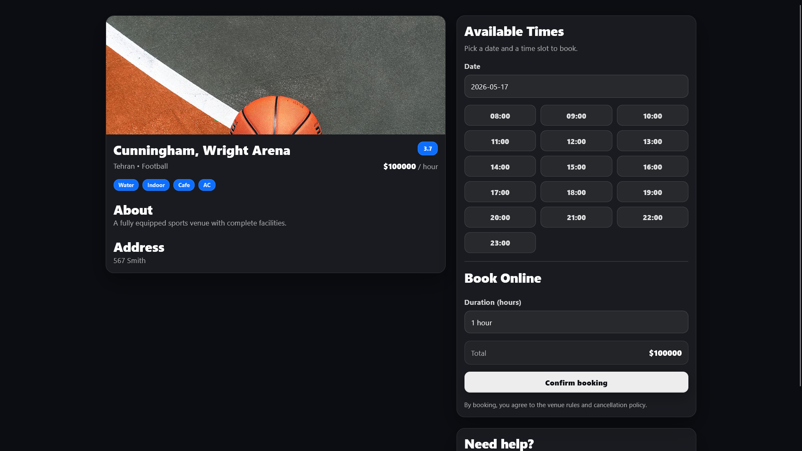
  <figcaption>Venue details page showing hall information, facilities, price, rating, and address.</figcaption>
</figure>

### Booking Slots


### Profile Page

<!-- screenshot: take a screenshot of the user profile page -->

<figure>
  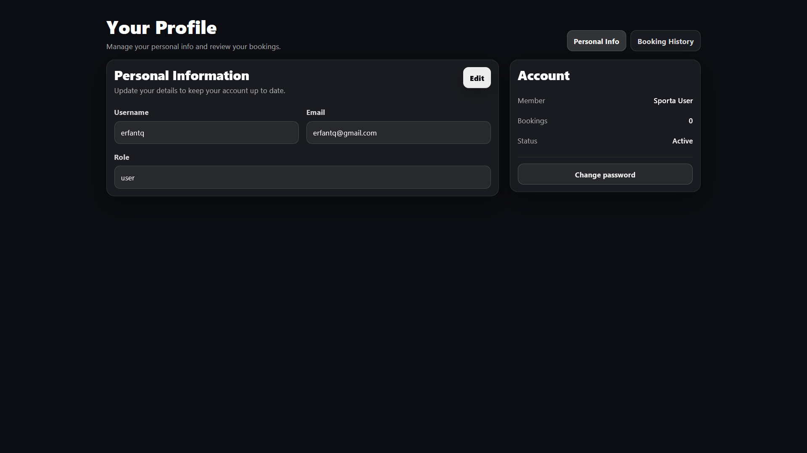
  <figcaption>User profile page for viewing and updating personal information.</figcaption>
</figure>

### Contact Support Page

<!-- screenshot: take a screenshot of the contact support form -->

<figure>
  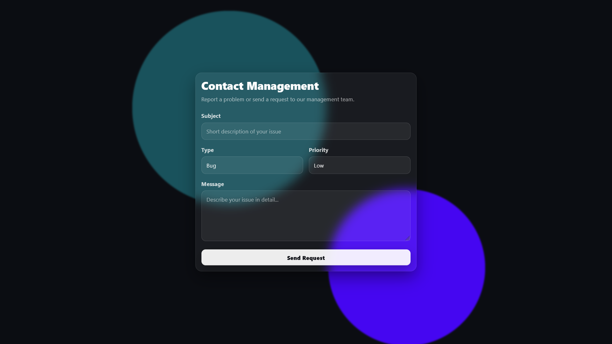
  <figcaption>Contact support page for submitting bug reports, account issues, payment issues, and other messages.</figcaption>
</figure>

### Admin Dashboard

<!-- screenshot: take a screenshot of the main admin dashboard -->

<figure>
  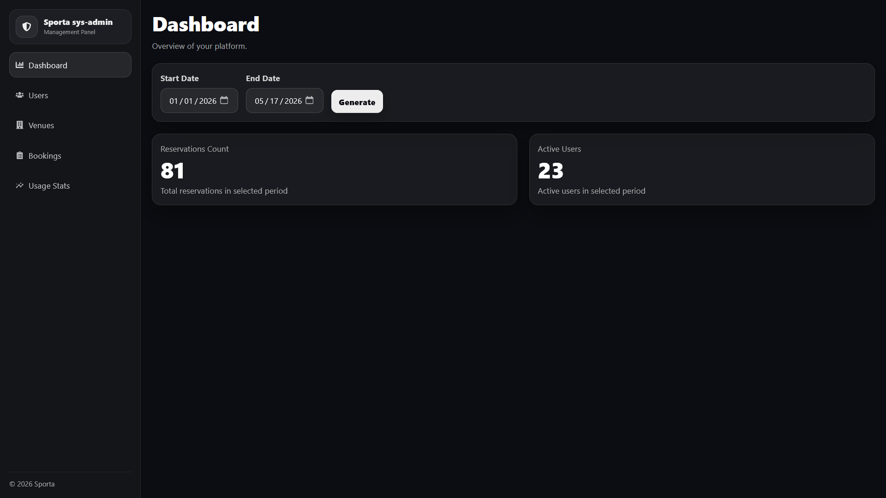
  <figcaption>Admin dashboard with system overview and management navigation.</figcaption>
</figure>

### Admin Users Management

<!-- screenshot: take a screenshot of the users management page -->

<figure>
  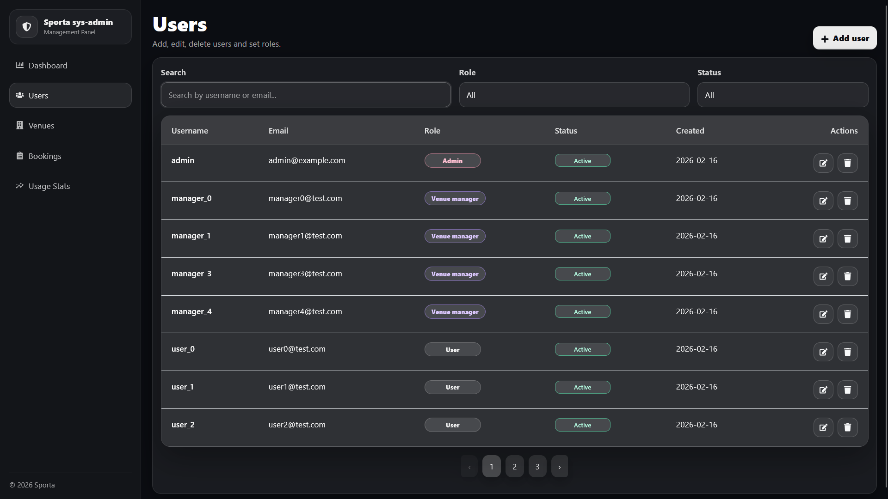
  <figcaption>Admin users management page for creating, editing, filtering, and deleting users.</figcaption>
</figure>

### Admin Venues Management

<!-- screenshot: take a screenshot of the venues management page -->

<figure>
  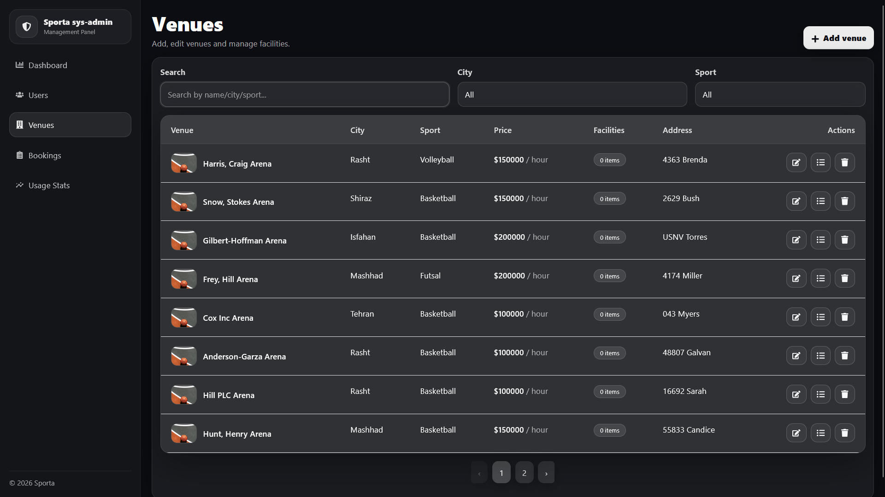
  <figcaption>Admin venues management page for creating, editing, deleting, and managing sports halls.</figcaption>
</figure>

### Admin Bookings Management

<!-- screenshot: take a screenshot of the bookings management page -->

<figure>
  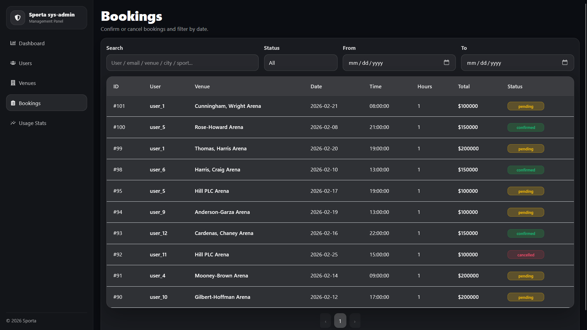
  <figcaption>Admin bookings management page for reviewing, filtering, confirming, or cancelling reservation requests.</figcaption>
</figure>

### Hall Usage Statistics

<!-- screenshot: take a screenshot of the reservation report page -->

<figure>
  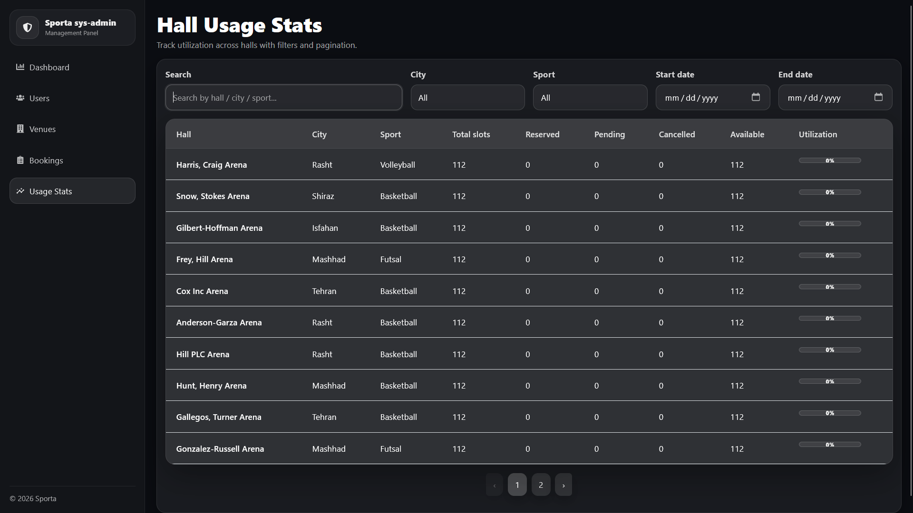
  <figcaption>Hall usage statistics page showing total, reserved, pending, cancelled, and available slots.</figcaption>
</figure>


---

## Backend Setup

Go to the backend directory:

```bash
cd backend
```

Create a virtual environment:

```bash
python -m venv venv
```

Activate the virtual environment.

On Windows:

```bash
venv\Scripts\activate
```

On Linux/macOS:

```bash
source venv/bin/activate
```

Install backend dependencies:

```bash
pip install -r requirements.txt
```

Apply database migrations:

```bash
python manage.py migrate
```

Seed initial data:

```bash
python manage.py seed_data
```

Run the Django development server:

```bash
python manage.py runserver
```

The backend will be available at:

```text
http://127.0.0.1:8000/
```

---

## Frontend Setup

Go to the frontend directory:

```bash
cd frontend
```

Install frontend dependencies:

```bash
npm install
```

Run the Vite development server:

```bash
npm run dev
```

The frontend will be available at:

```text
http://127.0.0.1:5173/
```

---

## Environment Variables

For better security, sensitive values such as Django secret key and email credentials should be stored in environment variables instead of being hardcoded in the source code.

Recommended backend `.env` example:

```env
DJANGO_SECRET_KEY=your-django-secret-key
DEBUG=True

EMAIL_HOST=smtp.gmail.com
EMAIL_PORT=587
EMAIL_USE_TLS=True
EMAIL_HOST_USER=your-email@gmail.com
EMAIL_HOST_PASSWORD=your-app-password
```

Recommended frontend `.env` example:

```env
VITE_API_BASE_URL=http://127.0.0.1:8000/api
```

---

## Main API Endpoints

| Method               | Endpoint                             | Description                            |
| -------------------- | ------------------------------------ | -------------------------------------- |
| `POST`               | `/api/register/`                     | Register a new user                    |
| `POST`               | `/api/login/`                        | Log in and receive JWT tokens          |
| `POST`               | `/api/token/refresh/`                | Refresh access token                   |
| `GET / PUT`          | `/api/profile/`                      | Get or update user profile             |
| `GET`                | `/api/halls/`                        | List sports halls                      |
| `GET`                | `/api/halls/<id>/`                   | Get hall details                       |
| `POST`               | `/api/bookings/create/`              | Create a booking request               |
| `GET`                | `/api/bookings/my-history/`          | Get current user's booking history     |
| `GET`                | `/api/bookings/`                     | List bookings for admins/managers      |
| `POST`               | `/api/contact/`                      | Submit a support message               |
| `POST`               | `/api/forgot-password/`              | Request password reset code            |
| `POST`               | `/api/verify-code/`                  | Verify reset code and set new password |
| `GET`                | `/api/system/stats/`                 | Get system statistics                  |
| `GET / POST`         | `/api/users/`                        | List or create users                   |
| `GET / PUT / DELETE` | `/api/users/<id>/`                   | Manage a specific user                 |
| `GET`                | `/api/admin/halls/`                  | List halls for admin/manager           |
| `POST`               | `/api/halls/create/`                 | Create a new hall                      |
| `PUT`                | `/api/halls/update/<id>/`            | Update hall information                |
| `DELETE`             | `/api/halls/delete/<id>/`            | Delete a hall                          |
| `PUT`                | `/api/halls/update-facilities/<id>/` | Update hall facilities                 |
| `GET`                | `/api/halls/reserves-count/`         | Get reservation count report           |
| `GET`                | `/api/admin/users/active-count/`     | Get active user count report           |
| `GET`                | `/api/admin/halls/usage-stats/`      | Get hall usage statistics              |
| `GET`                | `/api/halls/config/`                 | Get available city and sport options   |

---

## Database Models

### User

Extends Django's default user model and adds:

* `role`
* `phone_number`

Supported roles:

* `user`
* `venue-manager`
* `sys-admin`

### Hall

Stores sports venue information:

* manager
* name
* city
* sport
* location
* capacity
* price per hour
* description
* rating
* amenities
* image

### Booking

Stores reservation requests:

* user
* hall
* date
* start time
* end time
* status
* created time

Supported booking statuses:

* `pending`
* `confirmed`
* `cancelled`

### ContactMessage

Stores user support messages:

* user
* subject
* message
* type
* priority
* read status
* created time

### PasswordResetCode

Stores password reset verification codes:

* email
* code
* created time

The reset code is valid for 10 minutes.

---

## Usage Flow

### Regular User Flow

1. Register a new account.
2. Log in to the system.
3. Browse available sports halls.
4. Search or filter venues.
5. Open a venue details page.
6. Select an available date and time slot.
7. Submit a booking request.
8. View booking history from the profile or booking history section.
9. Contact support if needed.

### Venue Manager Flow

1. Log in as a venue manager.
2. Open the admin/manager dashboard.
3. Manage owned sports halls.
4. View booking requests for managed halls.
5. Confirm or cancel reservation requests.
6. Review hall usage statistics.

### System Admin Flow

1. Log in as a system admin.
2. Manage all users.
3. Manage all halls.
4. View all reservations.
5. Access system reports.
6. Review active user and reservation statistics.

---

## Future Improvements

* Add online payment integration
* Add booking cancellation from the user side
* Add email notifications for booking confirmation or cancellation
* Add advanced calendar view for venue schedules
* Add admin support message management
* Add production-ready environment configuration
* Add Docker support
* Add automated tests for backend APIs
* Add frontend form validation improvements
* Add deployment instructions


